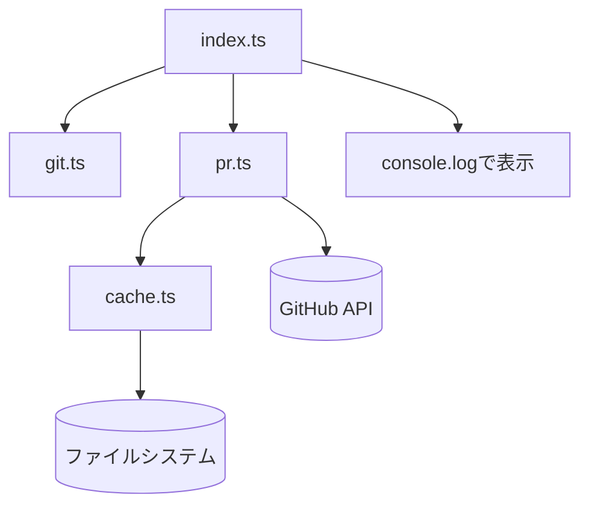

# GitHub PR Status for Starship

現在の Git ブランチに関連する GitHub Pull Request 情報を表示するスクリプト

## 概要

このスクリプトは、現在の Git ブランチに Pull Request が存在する場合、その番号とタイトルをターミナルハイパーリンク付きで表示します。Starship プロンプトのカスタムモジュールとして使用することを想定しています。

## 機能

- 現在のブランチの PR 情報を`gh`コマンドで取得
- PR 番号をクリック可能なリンクとして表示（対応ターミナルのみ）
- ブランチごとにキャッシュして高速化
- ブランチ切り替えを検出して自動更新

## 必要要件

- Bun
- GitHub CLI (`gh`)
- Git リポジトリ

## 使用方法

Starship の設定ファイル（`starship.toml`）にカスタムモジュールを追加：

```toml
[custom.github_pr]
command = "bun ~/.config/starship/scripts/github-pr/index.ts"
```

## 表示例

- PR あり: `#123 Fix critical bug`（#123 がクリック可能）
- PR なし: `[no PR]`
- gh コマンド未インストール: `[gh not installed]`

## キャッシュ

### ディレクトリ構造

```
~/.cache/starship/github_pr/
└── {repo_hash}/          # リポジトリパスのSHA256ハッシュ（16文字）
    ├── HEAD              # 最後に参照したブランチ名
    └── refs/
        └── {branch}.json # ブランチごとのPR情報
```

### キャッシュ処理

- **キャッシュがある場合**: そのまま使用
- **キャッシュがない場合**: `gh`コマンドで新規取得
  - 初回実行時
  - ブランチ切り替え時（キャッシュを削除）
  - キャッシュファイルが削除された時

## デバッグ

環境変数 `DEBUG=1` を設定すると詳細なデバッグ情報が `/tmp/github-pr-debug.log` に出力されます。

## ファイル構成

- `index.ts` - メインエントリポイント
- `git.ts` - Git 情報取得
- `pr.ts` - GitHub PR 情報取得
- `cache.ts` - キャッシュ管理
- `utils/` - ユーティリティ関数
  - `result.ts` - エラーハンドリング
  - `debug.ts` - デバッグ出力

## アーキテクチャ



### 処理フロー

1. **index.ts** → **git.ts**: Git 情報取得（リポジトリルート、現在のブランチ）
2. **index.ts** → **pr.ts**: PR 情報取得要求（GitInfo を渡す）
3. **pr.ts** → **cache.ts**: `getCache(gitInfo)`でキャッシュ確認
4. **pr.ts** → **GitHub API**: キャッシュがない場合、`gh pr view`で PR 情報取得してキャッシュ保存
5. **pr.ts** → **index.ts**: PRInfo 返却
6. **index.ts** → **表示**: ターミナルにハイパーリンク付きで出力
